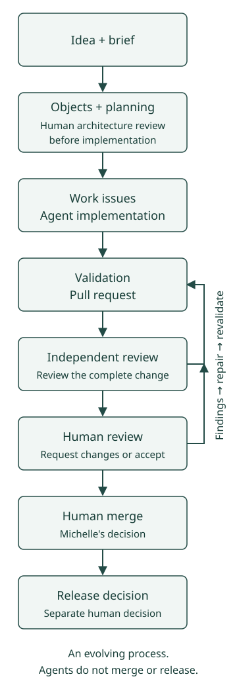

# How I Build

I'm experimenting with structured agent-assisted software development: planning, implementation, independent review, repair, and testing, with explicit human control boundaries.

**Agents may build and review. I own the final merge.**

## The workflow

This is the intended process. It is evolving, and the diagram is not a claim that every experimental run has followed every step successfully.

{ .build-process-diagram }

### The workflow in text

1. **Idea and brief:** define the problem and constraints.
2. **Object modeling and planning:** identify objects, relationships, actions, and attributes; bring the proposed architecture to human review before implementation.
3. **Issues and implementation:** break the plan into reviewable work and implement with agents.
4. **Validation and pull request:** run the applicable checks and present the resulting change.
5. **Independent review:** review the complete change. Findings return to repair, validation, and a fresh complete review.
6. **Human review:** I decide whether the change is ready. Requested changes return through the same repair and review loop.
7. **Human merge:** I own the merge decision. Passing checks does not authorize an agent to merge.
8. **Release decision:** publication is a separate human decision after the change is accepted.

## Practices

### [Human-owned merge decisions](human-merge-authority.md)

Agents can perform substantial development work while final acceptance stays with the human.

### [Fresh review after repair](fresh-review-after-repair.md)

A repaired change needs a complete review, beyond checking that the original findings disappeared.

### [Objects before screens](objects-before-screens.md)

Model the product before asking agents to invent navigation.

## Notes from the work

[Field Notes](../notes/index.md) will document observations from these experiments. The process is a subject of the work, not a finished methodology.
